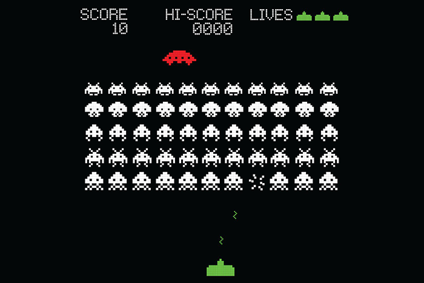

# Weekly Progress Update #1: 1 April 2018

As I think about how I should approach this final project, I feel that it will be most fruitful to align the assessment criteria with my own personal goals. My work should ideally expand upon the material covered in class, as well as provide avenues for me to think deeply about presentation and technical design.

Most of the assignments thus far have involved a main event loop which controls movement and positioning, which I think sets up a great foundation for me to dive into designing and making a full-fledged game.

Space Invaders, a 2D shooter game first released in 1978. _[Source](https://www.muralswallpaper.com/app/uploads/space-invaders-retro-plain.jpg)_

I am personally inspired by classic games such as Bomberman, Space Invaders, Tetris, [Pong](http://www.ponggame.org/) (including variations such as [Radial Pong](http://www.ponggame.org/radial-pong.php), which I discovered during my research online), and even more modern ones like [Dogfight](https://armorgames.com/play/3227/dogfight). Each of them pose their own challenges, particularly around object collision and modelling of the game state. My goal this week will be to figure out which game to make, as well as the scope of the game features.
